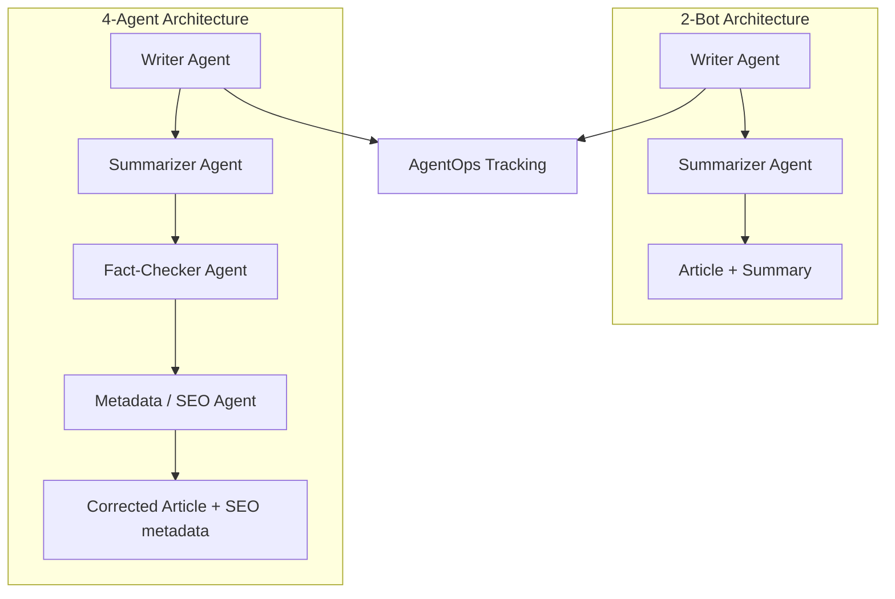

# 🤖 CrewAI 2-Bot & 4-Agent Architectures - Multi-Agent Content Pipelines with AgentOps

[](https://www.python.org/downloads/)
[](https://github.com/joaomdmoura/crewai)
[](https://deepmind.google/technologies/gemini/)
[](https://jupyter.org/)
[](https://agentops.ai/)
[](LICENSE)

**CrewAI 2-Bot & 4-Agent Architectures** demonstrates two end-to-end **CrewAI** content pipelines delivered as Jupyter notebooks. The **2-bot** crew rebuilds a session into a structured article plus summary, while the **4-agent** crew writes, summarizes, fact-checks, and SEO-metadata-tags the article - all optionally tracked with **AgentOps**.

---

## ✨ Key Features

### 🎯 1. Two Crew Architectures in Notebooks
- `2_agents_architecture.ipynb` - a minimal **Writer + Summarizer** crew.
- `4_agents_architecture.ipynb` - a full **Writer + Summarizer + Fact-Checker + Metadata** crew.
- Run cells top-to-bottom to execute each crew and write outputs.

### ✍️ 2. Session Rebuild Crew (2 Bots)
- **Writer Agent** produces a long, structured article (under 200 words).
- **Summarizer Agent** distills the article into a concise summary.

### 🛡️ 3. Content Creation Crew (4 Agents)
- **Writer Agent** writes the article (with intentional inaccuracies added as a challenge).
- **Fact-Checker Agent** verifies technical accuracy, marks `{errors}` and corrects them with `[fixes]`, and explains each correction.
- **Metadata Agent** generates SEO-friendly titles, tags, and structured publishing metadata.

### 📊 4. AgentOps Run Tracking
- Optional **AgentOps** integration (`agentops.init()`) records every run.
- Review traces and runs directly in your AgentOps dashboard.

### 🔄 5. Sequential Process with Context Passing
- Both crews run in `Process.sequential` mode with task context (e.g., the fact-checker receives the writer's output) for coherent multi-step generation.

---

## 🏗️ System Architecture



---

## 🛠️ Technology Stack

### Backend / Core
- **Agent Framework**: [CrewAI](https://github.com/joaomdmoura/crewai) (`Agent`, `Task`, `Crew`, `LLM`, `Process`).
- **LLM**: Google Gemini 2.0 Flash (`gemini/gemini-2.0-flash`) with low temperature.

### Data & Processing
- **Run Tracking**: [AgentOps](https://agentops.ai/) for session observability.
- **Interface**: Jupyter notebooks for interactive execution.

---

## 🚀 Getting Started

### Prerequisites
- **Python 3.10+**
- **CrewAI** (`pip install crewai "crewai[tools]"`)
- **Jupyter** (to open the notebooks)
- A **Gemini API key** (and optional **AgentOps API key**)

### 1. Repository Setup
```bash
git clone https://github.com/MarwanAbdellah/crew-ai-2-and-4-architectures.git
cd crew-ai-2-and-4-architectures
```

### 2. Install Dependencies
```bash
pip install crewai "crewai[tools]"
pip install jupyter agentops
```

### 3. Configure Environment
Set the API keys in the notebook cells (or as environment variables):
```env
GEMINI_API_KEY=your_gemini_api_key
AGENTOPS_API_KEY=your_agentops_api_key   # optional
```

### 4. Run
Open a notebook and run all cells top-to-bottom:
```bash
jupyter notebook 2-bots_architecture/2_agents_architecture.ipynb
jupyter notebook 4-bots_architecture/4_agents_architecture.ipynb
```

Optional: export a notebook to a script and run it directly:
```bash
jupyter nbconvert --to script 4-bots_architecture/4_agents_architecture.ipynb
python 4-bots_architecture/4_agents_architecture.py
```

---

## 🧪 Testing & Verification

There are no automated unit tests in this repository. To verify the workflow:

1. Set your API keys and run all cells in either notebook.
2. Confirm the writer and summarizer produce article + summary output.
3. In the 4-agent notebook, verify the fact-checker flags `{}`/`[]` corrections and the metadata agent emits SEO titles, tags, and JSON metadata.
4. If AgentOps is configured, confirm runs appear in your AgentOps dashboard.

---

## 📁 Project Structure

```text
crew-ai-2-and-4-architectures/
├── 2-bots_architecture/
│   └── 2_agents_architecture.ipynb       # Writer + Summarizer crew
├── 4-bots_architecture/
│   └── 4_agents_architecture.ipynb       # Writer + Summarizer + Fact-Checker + Metadata crew
├── LICENSE
├── .gitignore
├── .gitattributes
└── README.md
```

---

## 👤 Author

**Marwan Abdellah**
- **GitHub**: [@MarwanAbdellah](https://github.com/MarwanAbdellah)
- **LinkedIn**: [Marwan Abdellah](https://www.linkedin.com/in/marwan-abdellah/)

---

## 📄 License

Distributed under the MIT License. See `LICENSE` for more information.
